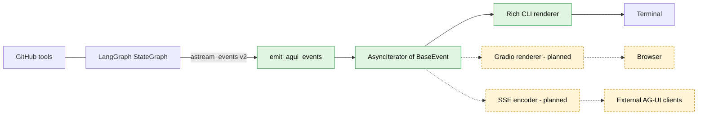

# AG-UI protocol layer

The CLI and (eventually) Gradio UI communicate with the LangGraph agent through
the [AG-UI](https://github.com/ag-ui-protocol/ag-ui) event protocol. The
emitter is the single LangChain-aware seam: it allows renderers to dispatch on
`event.type` without the need to 'know' about LangGraph.

| Node | Source file |
|---|---|
| `emit_agui_events` | [src/agui/emitter.py](../../src/agui/emitter.py) |
| Rich CLI renderer | [src/agui/renderer.py](../../src/agui/renderer.py) |
| Gradio renderer (planned) | [src/ui/handlers.py](../../src/ui/handlers.py) |

Legend: solid green = implemented. Dashed amber = planned.
