```mermaid
  flowchart TD
      Start([User Initiates Search]) --> InputTopics[User Enters Topics & Language]
      InputTopics --> ClickSearch[User Clicks 'Search' Button]

      ClickSearch --> GenerateThread[Generate UUID Thread ID]
      GenerateThread --> CreateConv[Create Conversation Entry in SQLite]
      CreateConv --> CreateAgent[Create Configured Agent with LangGraph]

      CreateAgent --> StreamAgent[Stream Agent Events with GitHub API]
      StreamAgent --> ProcessEvents[Process Streaming Messages]

      ProcessEvents --> ExtractRepos[Extract tracked_repositories from Final State]
      ExtractRepos --> ConvertRepos[Convert RepositoryRecord to Dict]
      ConvertRepos --> DisplayResults[Display Results in Markdown Output]

      DisplayResults --> UpdateReposState[Update extracted_repos State]
      UpdateReposState --> FormatTable[Format Repos for Table Display]
      FormatTable --> ShowTable[Show Repository Table]

      ShowTable --> UserAction{User Action?}

      UserAction -->|Enter repo name| InputRepoName[User Enters Repository Name]
      InputRepoName --> ClickSave[User Clicks 'Save' Button]

      ClickSave --> ValidateInput{Validate Input}
      ValidateInput -->|Empty| ErrorEmpty[Show Warning: Enter Repository Name]
      ValidateInput -->|Valid| ConvertToState[Convert Dict to FavoritesState]

      ConvertToState --> SearchAvailable[Search in available_repos List]
      SearchAvailable --> RepoFound{Repository Found?}

      RepoFound -->|No| CheckFormat{Contains '/'?}
      CheckFormat -->|No| ErrorNotFound[Show Error: Repository Not Found]
      CheckFormat -->|Yes| CreateMinimal[Create Minimal Repository Entry]

      RepoFound -->|Yes| PrepareRepo[Use Full Repository Data]
      CreateMinimal --> PrepareRepo

      PrepareRepo --> CreateSavedRepo[Create SavedRepository Pydantic Model]
      CreateSavedRepo --> CallAddRepo[Call FavoritesState.add_repository Method]

      CallAddRepo --> CheckExisting{Already Saved?}
      CheckExisting -->|Yes| ReturnFalse[Return False, Keep Unchanged]
      CheckExisting -->|No| AddWithTimestamp[Prepend to saved_repos with UTC Timestamp]

      AddWithTimestamp --> ReturnTrue[Return True]
      ReturnTrue --> SerializeState[Serialize State via model_dump]
      ReturnFalse --> SerializeState

      SerializeState --> UpdateBrowser[Update Browser State gr.BrowserState]
      UpdateBrowser --> PersistStorage[Persist to localStorage: repo_research_favorites_v1]

      PersistStorage --> ShowSuccess[Show Success: ✅ Saved repo_name]

      ErrorEmpty --> End([End])
      ErrorNotFound --> End
      ShowSuccess --> End

      style Start fill:#e1f5e1
      style End fill:#ffe1e1
      style PersistStorage fill:#e1e5ff
      style UpdateBrowser fill:#e1e5ff
      style CreateSavedRepo fill:#fff4e1
      style ConvertToState fill:#fff4e1
      style SerializeState fill:#fff4e1
```

## Explanation

### Key Phases

#### 1. Search Initiation
- User enters topics and optional language filter in the UI
- Search button triggers `SearchHandler.search_with_extraction` in `src/ui/handlers.py`
- Handler combines topics with language filter into search query

#### 2. LangGraph Agent Execution
- Thread ID generated via `uuid.uuid4()`
- Conversation metadata stored in SQLite via `ConversationStore`
- Configured agent created with LangGraph state graph
- Agent streams events and executes GitHub API tool calls
- Final state contains `tracked_repositories` with `RepositoryRecord` objects

#### 3. Repository Conversion and Display
- `RepositoryRecord` objects converted to dictionaries via `convert_repository_record_to_dict`
- Repositories formatted and displayed in Gradio Dataframe component
- Results shown with repository name, stars, language, and description
- User can select repositories to save

#### 4. Save Operation
- User enters repository name (owner/repo format) and clicks save button
- `FavoritesHandler.save_repository` validates input in `src/ui/handlers.py`
- Current favorites dictionary converted to `FavoritesState` Pydantic model via `model_validate`
- Handler searches for repository in extracted results list
- If not found but contains "/", creates minimal repository entry
- Otherwise returns error message

#### 5. Type-Safe Persistence Logic
- Repository data converted to `SavedRepository` Pydantic model with validation
- UTC timestamp automatically added via `datetime.now(UTC)`
- `FavoritesState.add_repository` method called in `src/ui/favorites.py`
- Method checks for duplicates by comparing `full_name` fields
- If not duplicate: repository prepended to `saved_repos` list (most recent first)
- If duplicate: returns `False` and state remains unchanged
- State serialized back to dictionary via `model_dump(mode="json")`

#### 6. Browser Storage
- Serialized state updates Gradio `BrowserState` component in `src/ui/app.py`
- `BrowserState` persists to browser's localStorage with key: `repo_research_favorites_v1`
- Data survives page refreshes and server restarts (stored client-side)
- Success message displayed: "✅ Saved {repo_name}"

### Architecture Highlights

**Type Safety**: The refactored implementation uses Pydantic models throughout:
- `SavedRepository`: Strongly-typed model for individual saved repositories
- `FavoritesState`: Container model with methods for add/remove/export operations
- All data validated at boundaries with automatic type coercion and validation errors

**Data Flow**: Plain dictionaries are used only at UI boundaries (Gradio state), with immediate conversion to/from Pydantic models for all business logic operations.

**Separation of Concerns**:
- `src/ui/app.py`: UI components and event wiring
- `src/ui/handlers.py`: Business logic handlers with type conversions
- `src/ui/favorites.py`: Pure data models and operations (no UI dependencies)
